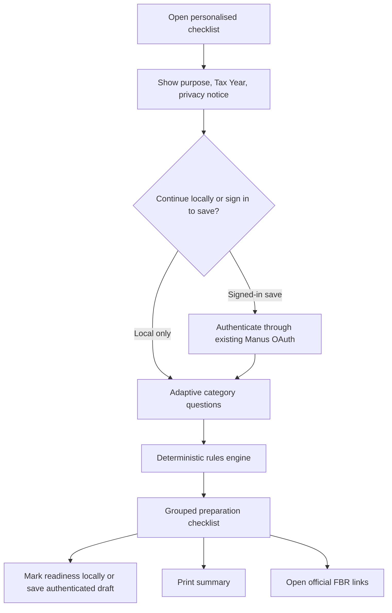

# Personalised Filing Checklist: Technical Specification

**Product:** Tax Return Saathi  
**Document status:** Implementation-ready specification  
**Prepared:** 22 August 2026  
**Scope:** Tax Year 2026 filing readiness support for Pakistan.  

## 1. Purpose and boundary

The **Personalised Filing Checklist** is a guided, deterministic feature that asks a visitor a short set of non-financial profile questions and produces a tailored list of records, information categories, and official filing areas to review before opening FBR IRIS. It is a filing-preparation tool, **not** a tax calculator, tax-return generator, legal opinion, eligibility determination, or submission workflow.

> The checklist must never state that a user is compliant, determine tax liability, calculate a refund or amount payable, select a statutory treatment from incomplete facts, or submit information to FBR. It must tell the user to verify current notices and obtain professional advice where their facts are complex or uncertain.

The feature must preserve the authored `App.jsx` tax algorithm, bilingual content, existing visual design, `/api/claude` browser contract, PWA behaviour, and current Tax Year 2026 update/archive modules. It should be built as a new, independently testable module and integrated through a new entry point rather than rewriting the existing app.

| Objective | Measure of success |
| --- | --- |
| Tailor preparation steps | The output changes only when a selected category changes, using versioned deterministic rules. |
| Reduce unnecessary data collection | The initial questionnaire accepts categories and document availability, never amounts, CNICs, NTN values, bank-account numbers, passwords, or document uploads. |
| Make sources visible | Every generated checklist item links to an official FBR source or an internal source-key that resolves to one. |
| Support privacy choice | Visitors may use the checklist locally without login; persistence is an opt-in signed-in capability. |
| Preserve auditability | A saved checklist stores its ruleset version, generated item snapshot, and source keys so its output can be reproduced later. |

## 2. Product scope

### 2.1 In scope for version 1

Version 1 covers a short, English/Urdu questionnaire, deterministic rules, a grouped checklist, a printable summary, local-only progress, optional authenticated persistence, and a source/version disclosure. The questionnaire is designed to identify **preparation categories**, such as salary, business activity, property-related income, banking profit, investments, foreign income/assets, withholding, and asset/debt information. It does not collect monetary values.

| Capability | Version 1 behaviour |
| --- | --- |
| Entry point | Add **“My personalised filing checklist”** beside the existing document-checklist journey. |
| Questionnaire | 8–12 adaptive category questions with “Not sure” and “Skip for now” choices. |
| Output | Grouped action items, why each item appeared, document status, official links, and a clear uncertainty banner where relevant. |
| Local session | Store answers and checked items in `localStorage` only after an explicit privacy notice. |
| Saved version | Let an authenticated user explicitly save, rename, reopen, or delete a checklist. |
| Export | Generate a browser-native print view; do not upload a PDF or store exported files. |
| Language | Use the app’s English/Urdu language preference; all new English and Urdu strings require human tax-content review before release. |

### 2.2 Explicitly out of scope

The first release must not accept tax documents, OCR photos, bank statements, CNICs, NTN credentials, salary amounts, property values, passwords, biometric data, or private IRIS credentials. It must not use the AI proxy to infer filing obligations from documents or free text. It must not trigger reminders, background jobs, email, WhatsApp, notifications, payment, IRIS login automation, or FBR submission.

## 3. User experience

### 3.1 Entry, consent, and completion flow

The feature should open in a contained panel or dedicated route that visually inherits the existing site’s typography, colour palette, mobile behaviour, and bilingual control pattern. The opening view must present the purpose, a non-affiliation disclaimer, the Tax Year/ruleset version, and the privacy choice before any question is shown.



The final result must use plain language. It should say **“Consider gathering”**, **“Review whether this applies”**, or **“Confirm with FBR or a qualified adviser”** instead of asserting legal conclusions. A user who selects “Not sure” should receive a short review item and an official-link path, not an implied answer.

### 3.2 Question catalogue

The following question set is intentionally category-based. The `questionId` values are immutable once released; labels can be revised while stored responses continue to map to the same semantic value.

| Order | Question ID | Prompt purpose | Allowed values | Conditional logic |
| --- | --- | --- | --- | --- |
| 1 | `returner_type` | Identify the broad filer context. | `individual`, `aop`, `company`, `not_sure` | `company` leads to a company-specific information notice; V1 remains primarily individual/AOP focused. |
| 2 | `filing_experience` | Tailor account-access and record-preparation prompts. | `first_time`, `filed_before`, `not_sure` | First-time users receive an IRIS access and registration review item. |
| 3 | `income_categories` | Identify high-level income evidence to review. | Multi-select: `salary`, `business`, `property`, `bank_profit`, `investments`, `other_income`, `none`, `not_sure` | Each selected category activates document-preparation items; no amount is requested. |
| 4 | `withholding_received` | Identify tax-deducted-at-source records to review. | `yes`, `no`, `not_sure` | `yes` or `not_sure` adds a withholding reconciliation item. |
| 5 | `assets_or_debts_changed` | Identify whether the user should review wealth/assets information. | `yes`, `no`, `not_sure` | `yes` or `not_sure` adds a review item without asking for values. |
| 6 | `foreign_connection` | Identify whether overseas income, assets, or tax residence needs specialist review. | `yes`, `no`, `not_sure` | `yes` adds a prominent “seek qualified advice / official guidance” item; no legal status is inferred. |
| 7 | `business_records_ready` | Help business users prepare records. | `yes`, `partly`, `no`, `not_applicable` | Applies only when `business` is selected. |
| 8 | `property_records_ready` | Help property users gather evidence. | `yes`, `partly`, `no`, `not_applicable` | Applies only when `property` is selected. |
| 9 | `supporting_records_ready` | Let users identify incomplete supporting records. | `all_ready`, `some_missing`, `not_started`, `not_sure` | Adds an action-oriented missing-records item as needed. |
| 10 | `save_preference` | Capture persistence choice, not a tax answer. | `local_only`, `sign_in_to_save`, `not_now` | Must be handled outside the tax-rule engine. |

### 3.3 Result layout

The generated output has five fixed sections, ordered for comprehension rather than inferred filing priority.

| Section | Content | Required interaction |
| --- | --- | --- |
| Before IRIS | Account access, Tax Year/ruleset version, official due-date link, disclaimer. | Open FBR link in a new tab. |
| Income records | Only the selected category-specific record prompts. | Mark each item “I have this”, “Need to find”, or “Not sure”. |
| Tax deducted / records check | Withholding and supporting-evidence review prompts. | Mark status and read the short rationale. |
| Assets and special situations | Category-neutral prompts for assets/debts and foreign-connection escalation. | Open “why this matters” text without collecting values. |
| Before you submit | Completion review, print, save (if signed in), delete local draft, and official-source disclosure. | Print-only export and explicit saved-draft control. |

Each item exposes a short **Why this appears** disclosure generated from its static rule rationale. The output must distinguish `review`, `gather`, and `seek-advice` action types. It must never label an item as “mandatory” unless a reviewed legal-content release explicitly authorises that wording.

## 4. Deterministic rules engine

### 4.1 Design

Use a versioned, client-safe JSON/TypeScript ruleset rather than an LLM. The same pure function must run in unit tests and in the browser. The server validates only the permitted question IDs/answers and persists a server-generated result snapshot for signed-in users.

Recommended module layout:

```text
shared/checklist/
  types.ts                    # Stable question, answer, rule, and output types
  ruleset-ty2026.ts           # Source-keyed question catalogue and rule definitions
  evaluateChecklist.ts        # Pure deterministic evaluator
  sources.ts                  # Official FBR source registry
client/src/checklist/
  PersonalisedChecklist.jsx   # UI shell and state machine
  ChecklistQuestion.jsx       # Accessible adaptive question control
  ChecklistResults.jsx        # Grouped results and status controls
  localDraft.ts               # Versioned localStorage adapter
server/checklist/
  checklistRouter.ts          # tRPC procedures
  checklistDb.ts              # Drizzle data-access functions
```

The project currently uses JavaScript for the uploaded app and TypeScript on the server. New shared/server code should be TypeScript; a React wrapper may be JSX where it is mounted beside the authored app. No changes are required to the existing tax engine.

### 4.2 Rule shape

```ts
type ChecklistRule = {
  id: string;
  ruleSetVersion: "TY2026.1";
  actionType: "review" | "gather" | "seek_advice";
  section: "before_iris" | "income" | "records" | "special" | "before_submit";
  appliesWhen: Array<{ questionId: string; includesAny?: string[]; equals?: string }>;
  item: {
    titleKey: string;
    bodyKey: string;
    rationaleKey: string;
    sourceKeys: string[];
  };
  excludesWhen?: Array<{ questionId: string; equals: string }>;
};
```

The evaluator receives a validated `ChecklistAnswers` object, filters matching rules, removes duplicate item IDs, sorts by section and stable `displayOrder`, and returns a `ChecklistResult`. It must add a generic uncertainty item whenever any answer is `not_sure`. The evaluator should expose a test-only trace of matching rule IDs, but the production UI should show only the user-friendly rationale.

### 4.3 Example rule

```ts
{
  id: "income.salary.records",
  ruleSetVersion: "TY2026.1",
  actionType: "gather",
  section: "income",
  appliesWhen: [{ questionId: "income_categories", includesAny: ["salary"] }],
  item: {
    titleKey: "checklist.salary.title",
    bodyKey: "checklist.salary.body",
    rationaleKey: "checklist.salary.rationale",
    sourceKeys: ["fbr_filing_guidance"]
  }
}
```

Tax-content changes must be made only through a reviewed ruleset release. A ruleset release requires a source review, `ruleSetVersion` increment, automated regression tests, and an update to the public in-app “Reviewed on” date. The system must not silently change a saved checklist’s historical result.

## 5. Data model and retention

### 5.1 Privacy tiers

| Tier | Storage location | Authentication | Contents | Retention |
| --- | --- | --- | --- | --- |
| Local draft | Browser `localStorage` | None | Whitelisted category answers, selected item status, ruleset version. | Until user clears it, uses “Start over”, or local browser data is cleared. |
| Saved draft | Database | Existing Manus OAuth | Same whitelisted answers plus checklist title, result snapshot, and timestamps. | Until user deletes it; provide an optional automatic-expiry policy before release. |
| Analytics | Aggregated event stream only | None | Event names, ruleset version, non-identifying category count; never answer values or item titles. | Platform analytics policy; no user-level reconstruction. |

The implementation must reject all keys not present in the answer schema. It must not add a free-text notes field in V1. It must never persist answers for an unauthenticated user to the database.

### 5.2 Database schema

Add a `filing_checklists` table and no document table. A separate item table is not necessary in V1 because the immutable `resultSnapshotJson` records the generated output at save time.

| Column | Type | Constraint / purpose |
| --- | --- | --- |
| `id` | `bigint` auto-increment | Primary key. |
| `userId` | `int` | Required foreign key to `users.id`; indexed. |
| `title` | `varchar(120)` | User-editable, server-trimmed; default “Tax Year 2026 checklist”. |
| `taxYear` | `int` | Required, initially `2026`. |
| `ruleSetVersion` | `varchar(32)` | Required immutable value, such as `TY2026.1`. |
| `answersJson` | `text` | Validated, whitelist-only JSON. |
| `resultSnapshotJson` | `text` | Server-generated checklist item IDs, labels/keys, source keys, and completion states. |
| `status` | enum | `draft`, `completed`, `archived`. |
| `createdAt`, `updatedAt`, `deletedAt` | timestamps | Audit and soft-delete support. |
| `expiresAt` | timestamp nullable | Optional policy-controlled expiry, never set without user-facing disclosure. |

The migration must create the table before adding any foreign key, create an index on `(userId, updatedAt)`, and be applied through the project’s schema-first workflow: update `drizzle/schema.ts`, generate migration SQL, review it, and execute it with the database migration tool. No destructive migration is needed for the initial table.

### 5.3 Local-draft contract

```json
{
  "schemaVersion": 1,
  "ruleSetVersion": "TY2026.1",
  "taxYear": 2026,
  "answers": {
    "returner_type": "individual",
    "income_categories": ["salary", "bank_profit"],
    "withholding_received": "yes"
  },
  "itemStatus": {
    "income.salary.records": "need_to_find"
  },
  "updatedAt": "2026-08-22T00:00:00.000Z"
}
```

Use a namespaced key such as `tax-return-saathi:filing-checklist:v1`. On a ruleset mismatch, keep the draft but show “This checklist has been refreshed; review the updated items” before regenerating output. On malformed JSON, delete only this key and show a non-sensitive recovery message.

## 6. tRPC API contract

The public local-only path uses no API. All persistence uses `protectedProcedure`, derives ownership from `ctx.user.id`, and never accepts a `userId` from the client.

| Procedure | Visibility | Input | Output | Rules |
| --- | --- | --- | --- | --- |
| `checklist.getRuleset` | `publicProcedure` | `{ taxYear: 2026 }` | Public question labels, source metadata, and ruleset version. | Optional in V1 if bundled client-side; no user data. |
| `checklist.create` | `protectedProcedure` | `{ title?, answers, itemStatus }` | Saved checklist summary. | Validate answers, server-evaluate result, set `userId` from context. |
| `checklist.listMine` | `protectedProcedure` | `{}` | User’s non-deleted checklist summaries. | Restrict by `ctx.user.id`; exclude answer JSON. |
| `checklist.getMine` | `protectedProcedure` | `{ id }` | Full saved checklist. | Return only when `userId` matches. |
| `checklist.update` | `protectedProcedure` | `{ id, title?, answers, itemStatus, expectedUpdatedAt }` | Updated checklist. | Optimistic-concurrency conflict on stale version; regenerate server snapshot. |
| `checklist.delete` | `protectedProcedure` | `{ id }` | `{ success: true }` | Soft delete or hard delete according to documented retention policy. |
| `checklist.export` | `protectedProcedure` | `{ id }` | JSON/print-safe data only. | Optional; no file stored server-side. |

Use Zod schemas with strict objects. The `answers` schema must set bounded array lengths, literal unions, and `.strict()` to reject unexpected keys. The server must call the same pure `evaluateChecklist` function used by the UI before persistence, so a client cannot save fabricated checklist results or source links.

```ts
const checklistAnswersSchema = z.object({
  returner_type: z.enum(["individual", "aop", "company", "not_sure"]),
  filing_experience: z.enum(["first_time", "filed_before", "not_sure"]),
  income_categories: z.array(z.enum([
    "salary", "business", "property", "bank_profit", "investments", "other_income", "none", "not_sure"
  ])).min(1).max(7),
  withholding_received: z.enum(["yes", "no", "not_sure"]),
  assets_or_debts_changed: z.enum(["yes", "no", "not_sure"]),
  foreign_connection: z.enum(["yes", "no", "not_sure"]),
  business_records_ready: z.enum(["yes", "partly", "no", "not_applicable"]),
  property_records_ready: z.enum(["yes", "partly", "no", "not_applicable"]),
  supporting_records_ready: z.enum(["all_ready", "some_missing", "not_started", "not_sure"])
}).strict();
```

## 7. Client implementation

### 7.1 State machine

The UI state should be explicit rather than inferred from component booleans.

```text
intro -> privacy_choice -> questions -> results
results -> saving -> saved
results -> printing
saved -> results
any state -> reset_confirmation -> intro
```

The state controller must support browser back behaviour, resume a local draft only after showing its ruleset date, and maintain a visible “Start over” control. Answers should update results immediately through the pure evaluator; server calls occur only when the user selects **Save to my account**.

### 7.2 Accessibility and language requirements

Every question group must use `fieldset`/`legend`; multi-select categories require checkbox labels with 44×44px touch targets; conditional follow-up questions must announce themselves through a polite live region; and focus must move to the newly displayed question or results heading. The feature needs keyboard-only navigation, high-contrast focus states, and a print stylesheet that removes navigation but retains the disclaimer, ruleset version, and source links.

New English and Urdu strings must use stable translation keys. Urdu text must declare `lang="ur"` and `dir="rtl"`; number/date formatting should remain unambiguous and retain an English ISO-like source date where it is necessary for official notice links.

### 7.3 Integration method

The current uploaded `App.jsx` must remain untouched. The recommended integration is to add a small entry component mounted from `client/src/main.jsx`, following the established pattern used by the Tax Year update panel. That component exposes a single launch control and renders the checklist panel/route. The checklist must not alter, reuse, or write into the existing tax-calculator state.

If a full-page experience is selected later, add a lightweight route wrapper outside `App.jsx` only after confirming the existing routing approach. The default remains a contained panel because it limits regression risk to the authored interface.

## 8. Security, safety, and content governance

| Risk | Required control |
| --- | --- |
| Tax advice is mistaken for a legal conclusion | Persistent disclaimer; neutral action verbs; uncertainty items; official links; no “eligible”, “correct”, “must file”, or “compliant” determination. |
| Sensitive information is entered | No free-text field, amount field, upload, identifier field, or credential field in V1; schema rejects unknown keys. |
| Saved checklist accessed by another account | `protectedProcedure`, server-derived user ID, per-record ownership predicate, tests for IDOR attempts. |
| Rule changes alter past saved results | Persist immutable ruleset version and result snapshot; show a newer-version banner rather than overwrite silently. |
| Incorrect or stale tax content | Source-key registry with official FBR URLs, reviewer/date metadata, release checklist, and a visible “Check FBR’s current notice” statement. |
| LLM hallucination | No LLM invocation in the decision path or content generation path. |
| Accidental analytics leakage | Emit only non-identifying aggregate events; never log raw answers, titles, exports, or source-link parameters containing IDs. |

The source registry should begin with FBR’s filing guidance and due-dates resources already referenced by the application. Ruleset reviewers must confirm current notices before changing deadline wording or any claim about a filing obligation. [1] [2]

## 9. Testing and acceptance criteria

### 9.1 Automated test matrix

| Test level | Cases |
| --- | --- |
| Rules-engine unit tests | One baseline per income category; multi-category deduplication; all `not_sure` paths; stable sort order; source-key existence; immutable ruleset version. |
| Schema tests | Reject unknown keys, identifiers, amounts, unexpected arrays, empty multi-selects, and oversized titles; accept every documented valid answer. |
| Router tests | Authentication required for persistence; ownership enforcement; stale-update conflict; server snapshot equals evaluator output; deletion hides records from `listMine`. |
| Database tests | Migration creates intended indexes/foreign key; soft/hard delete follows policy; records are isolated by user. |
| Component tests | Conditional questions appear and disappear correctly; keyboard navigation; English/Urdu label rendering; local reset; print control; “Not sure” message. |
| Regression tests | Existing `manusLlmProxy`, auth logout, Tax Year update/archive tests, production build, and PWA root assets remain passing. |

### 9.2 Required acceptance tests

1. A visitor selecting `salary` and `withholding_received=yes` sees salary-record and withholding-review items, without any amount or tax-liability prompt.
2. A visitor selecting `foreign_connection=yes` sees only a neutral escalation item and official source links; the tool does not classify residence or foreign-tax treatment.
3. A local-only user can refresh the browser and resume a checklist, then permanently remove it with **Start over**.
4. A signed-in user can save two checklists, retrieve only their own, and delete one. A second user cannot access the first user’s ID.
5. Changing answers regenerates the checklist deterministically; a saved record holds a reproducible snapshot and ruleset version.
6. The full interaction works on a 375px viewport, keyboard-only navigation, and Urdu display; print output includes source links and the disclaimer.
7. The existing application’s calculation flows, bilingual UI, PWA assets, AI proxy, homepage metadata, and Vite preview remain unchanged and passing.

## 10. Delivery plan

| Milestone | Deliverables | Exit condition |
| --- | --- | --- |
| A. Content and rule review | Approved question copy, Urdu translations, source registry, `TY2026.1` rule table, disclaimer text. | Tax-content reviewer signs off on every user-visible item. |
| B. Local-only checklist | Shared rules engine, panel, local draft, print view, unit/component tests. | No login or database dependency; all deterministic tests pass. |
| C. Authenticated persistence | Drizzle schema/migration, db helpers, protected tRPC router, saved-draft UI, ownership tests. | CRUD works only for the signed-in owner. |
| D. Quality and release | Accessibility review, mobile/browser verification, content freshness check, build/test run, checkpoint. | Acceptance tests complete and no regression in existing features. |

Each milestone should be independently releasable. Version 1 can stop after Milestone B if the product chooses to avoid server persistence initially; Milestone C is then added without changing the questionnaire or rules engine contract.

## 11. Definition of done

The feature is ready for release only when the deterministic ruleset is source-reviewed, privacy controls are enforced by schema and UI, local-only usage works without login, authenticated records are owner-scoped, all listed tests pass, the hosted preview is verified without Vite WebSocket errors, and the final release note identifies the ruleset version and review date.

## References

[1] [Federal Board of Revenue, “File Income Tax Return”](https://www.fbr.gov.pk/categ/file-income-tax-return/51147/80860/71158)  
[2] [Federal Board of Revenue, “Income Tax due dates”](https://www.fbr.gov.pk/categ/income-tax-due-dates/51147/40846/81148)
